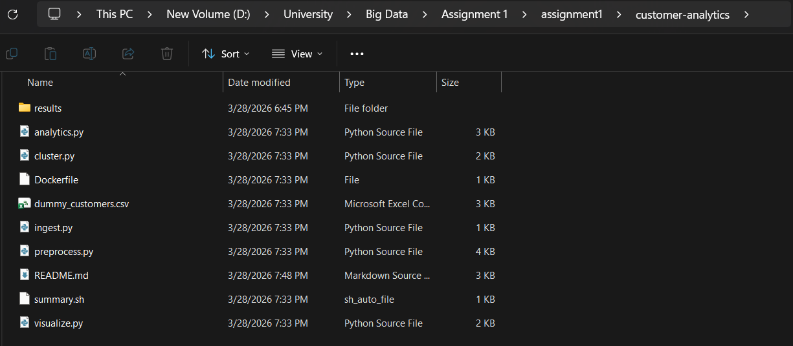
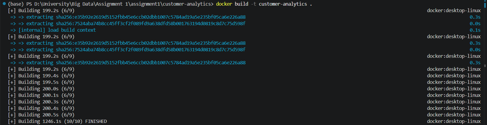
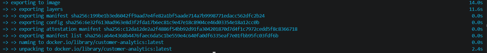
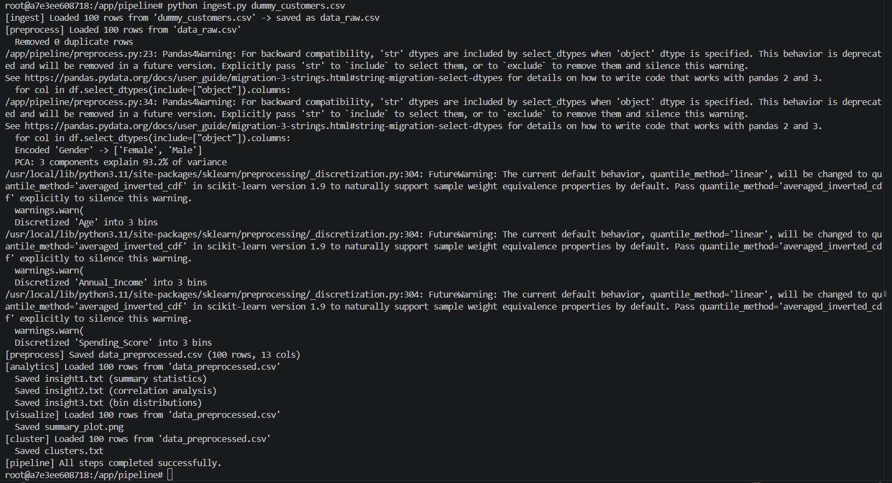
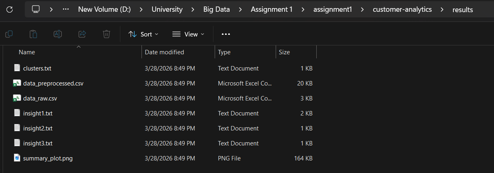

# Customer Analytics Pipeline

## Team Members
- Amr Sherif Nabil          231000045
- Adham Ahmed Mekky         231001296
- Adham Ahmad Abdelaal      231000313
- Belal Mohammed Amer       231000272

## Overview

This project implements a containerized customer analytics pipeline inside Docker.  
The pipeline starts with raw customer data, performs preprocessing and feature engineering, generates textual insights, creates visual summaries, and applies K-Means clustering.  
Each Python script automatically calls the next script in the pipeline, making the full workflow reproducible from start to finish.

## Execution Flow

```
ingest.py → preprocess.py → analytics.py → visualize.py → cluster.py
```

Each script calls the next via `subprocess.run`, passing the latest CSV path as a command-line argument:

1. **ingest.py** — Reads the raw dataset, saves `data_raw.csv`, calls `preprocess.py`.
2. **preprocess.py** — Cleans data, encodes categoricals, scales numerics, applies PCA, discretizes columns, saves `data_preprocessed.csv`, calls `analytics.py`.
3. **analytics.py** — Generates 3 textual insights (`insight1.txt`, `insight2.txt`, `insight3.txt`), calls `visualize.py`.
4. **visualize.py** — Creates histogram, correlation heatmap, and PCA scatter plot, saves `summary_plot.png`, calls `cluster.py`.
5. **cluster.py** — Applies K-Means (k=4) on PCA components, saves cluster counts to `clusters.txt`.

## Docker Commands

### Build the Image

```bash
docker build -t customer-analytics .
```

### Run the Container (Interactive)

```bash
docker run -it --name customer-analytics-container customer-analytics
```

### Run the Full Pipeline (Inside the Container)

```bash
python ingest.py dummy_customers.csv
```

### Copy Results to Host & Clean Up (From Host)

```bash
bash summary.sh
```

The following structure shows all project files and generated outputs.
## Project Structure

```
customer-analytics/
├── Dockerfile
├── ingest.py
├── preprocess.py
├── analytics.py
├── visualize.py
├── cluster.py
├── summary.sh
├── dummy_customers.csv
├── README.md
└── results/
    ├── data_raw.csv
    ├── data_preprocessed.csv
    ├── insight1.txt
    ├── insight2.txt
    ├── insight3.txt
    ├── clusters.txt
    └── summary_plot.png
```
### Folder Structure Screenshot



## Docker Build

Command used to build the image:

```bash
docker build -t customer-analytics .
```



Build completed successfully:




## Run Container

The container was started using:

```bash
docker run -it --name customer-analytics-container customer-analytics
```

### Container Started


## Execute the Pipeline

The full pipeline was executed inside the container using:

```bash
python ingest.py dummy_customers.csv
```

### Pipeline Execution



## Results

After running the pipeline, the generated outputs were copied to the `results/` folder using:

```bash
bash summary.sh
```

### Output Files

* data_raw.csv
* data_preprocessed.csv
* insight1.txt
* insight2.txt
* insight3.txt
* clusters.txt
* summary_plot.png

### Results Screenshot




## Sample Outputs

### insight1.txt (Summary Statistics)
Shows descriptive statistics (mean, std, min, max, quartiles) for all numeric features.

### insight2.txt (Correlation Analysis)
Lists the top 5 most correlated feature pairs in the dataset.

### insight3.txt (Bin Distributions)
Shows the distribution of samples across discretized bins for Age, Income, and Spending Score.

### clusters.txt
Shows the number of samples assigned to each of the 4 K-Means clusters.

### summary_plot.png
Contains three visualizations: a histogram, a correlation heatmap, and a PCA scatter plot.


## Repository and Docker Image

### GitHub Repository

https://github.com/AdhamMekky/customer-analytics-pipeline

### Docker Hub Image

https://hub.docker.com/r/adhammekky/customer-analytics
